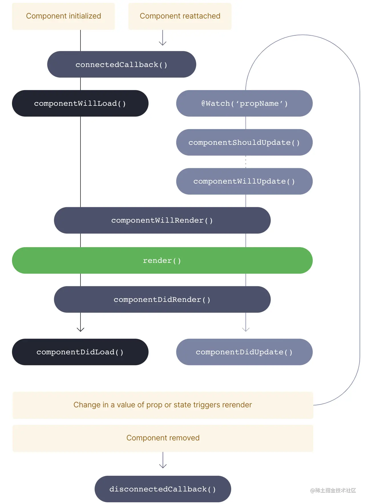
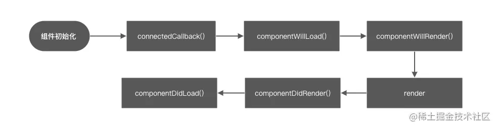
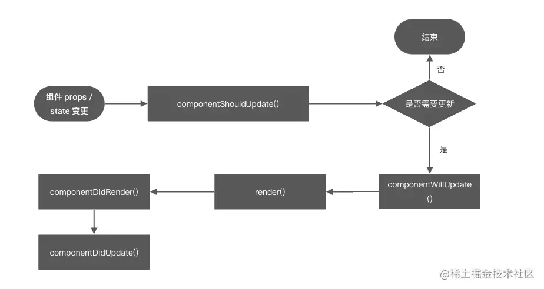

# leran-test
leran test
## Stencil 来构建 Web Components 组件几大优势
1. 虚拟DOM
2. Async rendering (inspired by React Fiber) fiber 的性能优势 像Fiber一样的调度模式
3. Reactive data-binding 单向数据流
4. TypeScript
5. 组件懒加载
6. JSX TSX支持
7. 无依赖组件
8. 静态网站生成(SSG)

## Stencil 常用装饰器 类似AOP编程
Stencil 提供装饰中类有8种，丰富了我们的所有使用场景 

### @Component()
用来定义 Stencil 组件的装饰器， 每个组件都应声明这个装饰器
文档地址 https://stenciljs.com/docs/component#component-decorator
```js
@Component({
  tag: 'my-component',
  styleUrl: 'my-component.css',
  shadow: true,
})
```
@Component() 一般会带有 options 来声明一些组件的特性和配置。 必填的是 tag 字段，必须是一个由‘-’连接的字符串，用于声明当前组件应该匹配到那个 tag 标签下
可以看出 @Component 装饰器是用来声明当前 class 是一个 Stencil 组件的关键装饰器，只有声明后，编译脚本才会正确识别编译，是一个必需的装饰器。

### @Prop()
是用来定义声明当前 Stencil 组件 element 元素上的属性和继承数据。它可以自动解析出这些数据，并声明成当前组件 class 的一个变量，允许我们开发使用，其实类似于 Vue 和 React。它的作用就是用来获取继承的数据并加以使用。
```jsx
export class MyComponent {
  @Prop() first: string;
  @Prop() middle: string;
  @Prop() last: string; 

  private getText(): string {
    return format(this.first, this.middle, this.last);
  }

  render() {
    return <div>World! I'm {this.getText()}</div>;
  }
}

// index.html
<my-component first="Stencil" last="'Don't call me a framework' JS"></my-component>
```
@Prop() 也可以携带配置来进行相关props的预处理。例如
```ts
  // 把 tag 里面的 complete 映射到组件里的 isComplete
@Prop({ attribute: 'complete' }) isComplete: boolean;

// 声明当前 props 不可变更
@Prop({ mutable: true }) thingToDo: string;

// reflect 可以决定当前的属性是不是在 tag 上可访问
@Prop({ reflect: true }) timesCompletedInPast: number = 2;

```

### @State()
与 react state一样， 改变可以触发更新， 如果是引用类型 必须改变其地址
```tsx 
@State() items: string[];
 // our original array
this.items = ['ionic', 'stencil', 'webcomponents'];
 // update the array
this.items = [
  ...this.items,
  'awesomeness'
]

```

### @Watch()
@Watch() 的使用也是比较直观，用于监控 prop/state 的更新, 类似于 useEffect + 依赖项
```tsx
export class LoadingIndicator {
  @Prop() activated: boolean;
  @State() busy: boolean;

  @Watch('activated')
  watchPropHandler(newValue: boolean, oldValue: boolean) {
    console.log('The new value of activated is: ', newValue);
  }


  @Watch('busy')
  watchStateHandler(newValue: boolean, oldValue: boolean) {
    console.log('The new value of busy is: ', newValue);
  }
}
```

### @Element()
@Element() 其实是为了提供在组件内访问当前 host element 示例的能力。当我们在组件内部定义了 @Element() el: HTMLElement 的时候，在组件初始化过程中会把当前的 HTMLElement 实例 return 到 el 这个变量上，让我们可以访问当前的 element，比如获取属性，外包围的信息等。 可以说它是连接了组件内部和具体挂载 ELement 的一个桥梁。
```tsx
export class TodoList {

  @Element() el: HTMLElement;

  getListHeight(): number {
    return this.el.getBoundingClientRect().height;
  }
}
```

### @Method()
@Method() 的作用是声明当前的 function 可以在组件的外部访问到，类似于 class 的 public 属性。 相当于挂载实例上的方法
```tsx
@Method()
  async showPrompt() {
    // show a prompt
  }
await customElements.whenDefined('todo-list');
const todoListElement = document.querySelector('todo-list');
await todoListElement.showPrompt();
```
注意: 值得注意的是，我们并不推荐一个组件对外暴露过多的 methods，因为它会使组件的数据流动变的不可控或难以维护，我们应该尽量使用 props 来控制一些组件的内部逻辑

### @Event()
@Event() 装饰器的作用是用来声明 DOM event，并提供了 emit 的方法来触发
```tsx
export class TodoList {
  @Event() todoCompleted: EventEmitter<Todo>;

  todoCompletedHandler(todo: Todo) {
    this.todoCompleted.emit(todo);
  }
}
// jsx
<todo-list onTodoCompleted={ev => this.someMethod(ev)} />
// js
Element.addEventListener('todoCompleted', event => {
    console.log(event.detail.value);
});
```
Event() 还有几个可选的 options 如下：
```ts
@Event({
    eventName: 'todoCompleted', // 事件名称
    composed: true, // 冒泡事件是否逃逸出当前的 shadowdom
    cancelable: true, // 事件是否可以被取消
    bubbles: true, // 事件是否冒泡到父级
  }) todoCompleted: EventEmitter<Todo>;
```
@Event() 可以说你连接了DOM事件，可以在组件中快速的声明，使用 DOM 事件的特性，最终还是编译回到原生的 DOM 事件。

### @Listen()
Listen 的作用就是监听子组件冒泡上传的 DOM 事件，和一些公共的事件，比如 scroll、keydown、mousemove 等。
```jsx
@Listen('keydown')
  handleKeyDown(ev: KeyboardEvent){
 // xxx
}

export interface ListenOptions {
  target?: 'body' | 'document' | 'window';
  capture?: boolean;
  passive?: boolean;
}


 @Listen('scroll', { target: 'window' })
  handleScroll(ev) {
    console.log('the body was scrolled', ev);
  }

```

## 声明周期  这块与react 非常像
* connectedCallback()
* disconnectedCallback()
* componentWillLoad()
* componentDidLoad()
* componentShouldUpdate(newValue, oldValue, propName): boolean
* componentWillRender()
* componentDidRender()
* componentWillUpdate()
* componentDidUpdate()
* render()

这样看每个生命周期的回调的作用时间点或者作用场景是很不直观的，我们抽象下以四个维度来划分下我们日常使用组件的场景：组件初次加载、组件重新连接、组件更新、组件移除。




### 首次加载
初始化 --> connectedCallback --> componentWillLoad  --> componentWillRender --> render --> componentDidRender --> componentDidLoad


### 组件重新连接
组件重新连接是当把一个 tag 标签渲染后，执行 remove 操作后，重新 append 这个 tag 标签的时候触发。
connectedCallback
所以可以发现，只有 onnectedCallback() 会在两种情形下同时调用，所以一些需要在组件显示的时候执行的逻辑都需要放在 onnectedCallback() 里面。

### 组件更新
当组件初始化完成后我们改变 props 或者 state 定义的变量的时候，会触发组件的检测流程，通过componentShouldUpdate() 来判断新老值是否有变更，从而决定当前组件是否需要更新。


### 组件移除
组件移除的逻辑还是比较直接，调用 disconnectedCallback()

### 多层嵌套组件的生命周期顺序
这个与react一样

### 一些关于声明周期的一些建议
与 React 有点不一样
* 推荐在 componentWillRender() 生命周期中添加一些副作用的函数，因为它执行在 render 之前，会把一些副作用收集并减少一些重复渲染。同一个道理，我们不推荐在 componentDidLoad(), componentDidUpdate() 或者 componentDidRender() 中执行一些副作用，因为它还会造成一些重复渲染导致一些性能问题。
* 尽量在 disconnectedCallback 中移除组件中用到的所有监听函数，和定时器相关。
* 尽量减少组件非必要更新的频率，利用好缓存，或者功能性组件，可以提升性能。

#### Ref
可以让我们很方便的获取这个 HTMLElement 实例的属性
```jsx
 <div ref={(element) => (this.ele = element)}></div>
```

#### Slot
Slot 插槽大家也不陌生，在 Vue 或者 React 都有一样的概念，它可以把元素包裹的 html 片段映射到 JSX 指定 slot 的地方。并且还可以加以 name 作为 attr 区分
```jsx
render(){
  return(
    <my-component>
      <p slot="item-start">I'll be placed before the h1</p>
      <p slot="item-end">I'll be placed after the h1</p>
    </my-component>
  )
}

render(){
  return [
    <slot name="item-start" />,
    <h1>Here is my main content</h1>,
    <slot name="item-end" />
  ]
}
```

#### Fragment 呈现组件
Fragment 可以用来声明一个无状态组件，意思就是组件内部没有状态，只会通过传值来改变内部渲染的内容。也是组件库中的常用方式之一。
```jsx
render() {
  return (<Fragment>
    // first top level element
    <div class="container">
      <ul>
        <li>Item 1</li>
        <li>Item 2</li>
        <li>Item 3</li>
      </ul>
    </div>

    <div class="another-container">
      ... more html content ...
    </div>
  </Fragment>);
}
```

#### Host
Render 函数内部 jsx 代码片段可以用 Host 标签包裹，添加到 Host 的标签的属性会被映射到当前组件的最外层 tag 上。
```jsx
return (
      <Host class="host-point">
        <button class="sten-button"><slot></slot></button>
      </Host>
    )
```